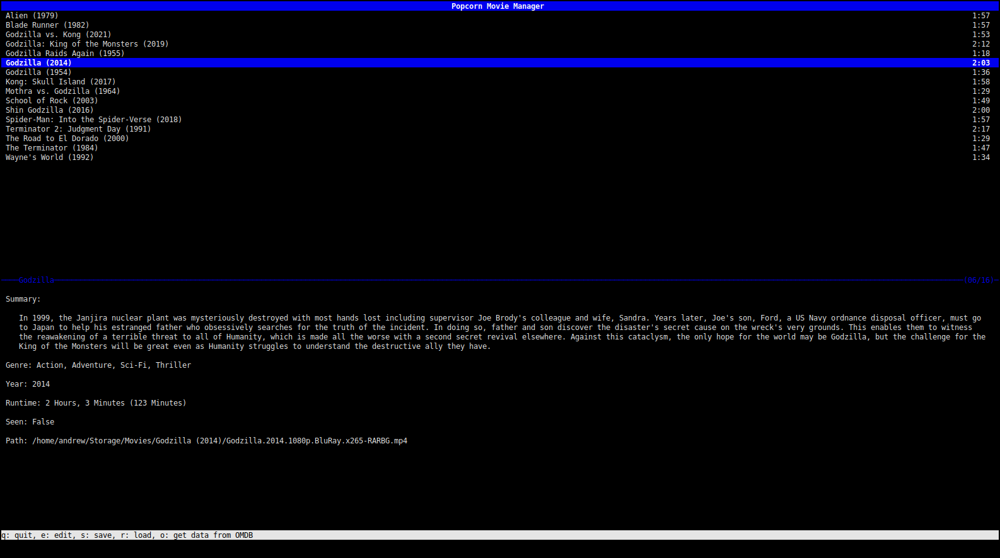

# popcorn: a command line movie manager

Popcorn is an ncurses-based movie manager for Linux. With it you can:

* Sort/filter/search your movie collection
* Track viewing stats
* Get metadata from OMDB

...all from the terminal.

## Dependancies:
* libncurses
* libcurl
* cJSON

## Compilation
1. Install all required dependancies
2. Clone this repo with `git clone {REPO URL}` and `cd` into it
3. Run `make`
4. Run the binary

Note: There is no "make install" recipe, but if you want to be able to use `popcorn` without being in the directory just move it into `/usr/bin`.

## Configuration
Popcorn will by default look in `$HOME/.config/popcorn` or `$XDG_CONFIG_COME` for a file called "config". There is an example file provided in `share`. The current configurable options are:

1. The directiory to find movies in
2. The path to save the database to
3. The default video player
4. An OMDB api key
